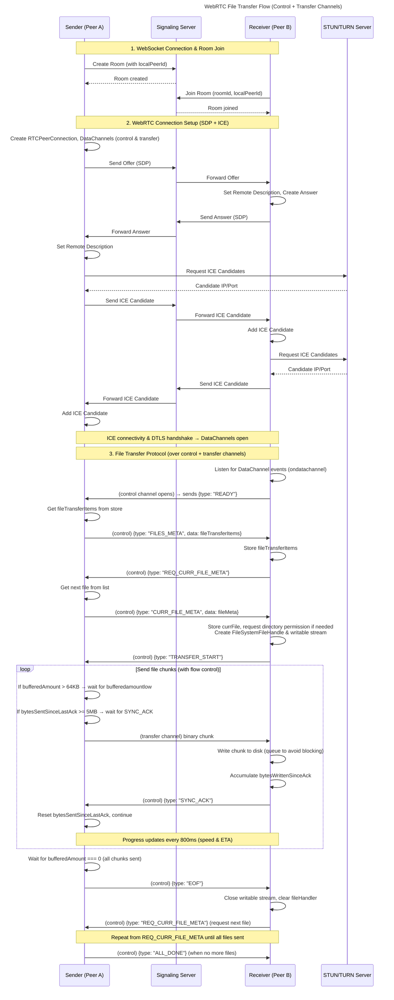

# Peerflow

Peerflow is a free file sharing app without a middleman server for file storage. It shares files directly between two devices using WebRTC data channels over UDP, with a lightweight signalling server only for room creation, room join, and peer negotiation.

The goal is simple: open a room, connect another device, and transfer files directly without accounts, uploads, or forcing an app install on the receiver.

## What It Does

- Creates a temporary room for 2 devices.
- Connects those devices through WebRTC.
- Transfers files directly from sender to receiver.
- Keeps the signalling server out of the actual file path.
- Lets the receiver save files directly to local storage.
- Supports room sharing through a room ID and QR code.

## Tech Stack

- Frontend: Next.js 16, ReactJS, Tailwind, Zustand, Sonner
- Realtime transfer: WebRTC DataChannels
- Signalling: Cloudflare Workers + Durable Objects + WebSockets
- Runtime and workspace tooling: Bun + Turborepo
- Deployment:
  - Web app via OpenNext for Cloudflare
  - Signalling server via Wrangler

## How It Works

1. The sender selects files.
2. A room is created through the signalling server.
3. The sender shares the room ID or QR code.
4. The receiver joins the room.
5. Both peers complete WebRTC signalling.
6. Files are transferred directly over the WebRTC transfer channel.
7. The receiver writes files to disk locally.

The signalling server helps peers find each other, but it does not store file contents.

## Getting Started

### Install Dependencies

```bash
git clone https://github.com/Prajwal-17/peerflow.git
bun install
```

## Running Locally

```bash
# set env variables
NEXT_PUBLIC_SIGNALLING_SERVER=ws://localhost:8787/ws
```

```bash
# start both signalling server & the frontend
bun run dev
```

The web app runs on `http://localhost:4000`.

### Peerflow Sequence Diagram

<details>
    <summary>A full flow of how WebRTC transfer works</summary>



</details>

## Notes

- Code before migrating to Cloudflare:
  - https://github.com/Prajwal-17/peerflow/tree/c2c4a263f90ba4a80d78fb33ecb553fc85baa3e1

# Learnings

**Reference Docs**

- https://developers.cloudflare.com/durable-objects/get-started/
- Using websockets in **Durable Objects**
  - https://developers.cloudflare.com/durable-objects/best-practices/websockets/
- Lifecycle
  - https://developers.cloudflare.com/durable-objects/concepts/durable-object-lifecycle/

## WebRTC

- you set a `pc.ondatachannel = (event) => { ... }` handler to detect data channels
- you set a `ctrlChannel.onmessage = (event) = { ... }` handler to access & process events on Control and transfer channels
- Webrtc has one `onmessage` listener per channel, we have handle different steps by passing different events through JSON payloads
  - eg `msg.type === 'total_files_meta'`: update UI in receiver with list of incoming files
- While handling different messages through single channel better to switch case.

## Two Data-Channels

1. **The Control Channel:** This channel is only used for sending lightweight information, like metadata , event or json strings.
2. **The Transfer Channel:** This channel is only used for sending actual file raw binary data.

## Debugging

- visit chrome://webrtc-internals for debugging webrtc connections
- enable DataChannel message recordings to debug channel messages
- watch these to check if the connection is successfull

```
// peer 1
ICE connection state: new => "completed"
Connection state: new => "connected"
Signaling state: new => "stable"
ICE Candidate pair: (not set):43809 <=>(not set):51878

// peer 2
ICE connection state: new => "connected"
Connection state: new => "connected"
Signaling state: new => "stable"
ICE Candidate pair: (not set):51878 <=>(not set):43809
```

- To Debug if data is transferring through channels, use
  - Stats graph for data-channel(lable=control)
  - Stats graph for data-channel(lable=transfer)

## Back pressure

**Problem**

- while transferring a big file around 1GB, we cannot do `transferChannel.send(1GB_buffer)` at once, this means you are loading 1GB file into RAM hence the browser will crash.
- Even if you chunk the file into 64KB pieces, a fast while loop will push chunks into the Data Channel much faster than your internet can transit them. The channel's internal buffer will overflow, and the connection will terminate.
- Buffer overflow can cause packet loss in `SCTP` proctocol

**Solution**

- Backpressure - It is a control mechanism in which a consumer signals a producer to temporarily pause or reduce the rate of data production, preventing buffer overflows or data loss until the consumer catches up.
- ON SENDER SIDE
  - `RTCDataChannel` has property of `bufferedAmount` which is a count bytes currently sitting the queue waiting to be sent
  - so if `bufferedAmount` > `LIMIT(64KB)` stop the producer
  - And now you cant use a while loop to check if buffer is empty so set a `bufferedAmountLowThreshold(64KB)` -> the webrtc fires an event`onbufferedamountlow` now resume the producer
  - for this logic await a `Promise` -> resolve it when `onbufferedamountlow` triggers -> then continue to send

```ts
while (offset < currFile.size) {
  if (transferChannel.bufferedAmount > this.MAX_BUFFER_THRESHOLD) {
    await new Promise<void>((resolve) => {
      transferChannel.onbufferedamountlow = () => {
        transferChannel.onbufferedamountlow = null;
        resolve();
      };
    });
  }

  if (bytesSentSinceLastAck >= this.ACK_THRESHOLD) {
    await new Promise<void>((resolve) => {
      this.waitForAckResolver = () => resolve;
    });
    bytesSentSinceLastAck = 0;
  }

  // progress calculation logic
  // send binary data
}
```

- ON RECEIVER SIDE
  - Incoming chunks are written to user's disk through `writableStream`
  - But while reciving data chunks 1st it is pushed to a `sequential promise queue`
  - https://medium.com/@lcgarcia/mastering-javascript-promises-building-a-promise-queue-from-scratch-d04902cbd6aa
  - After writing file to disk it updates `bytesWrittenSinceAck` if it hits threshold sends a acknowledgement msg back to sender.

```ts
writeQueue: Promise<void> = Promise.resolve();

private listenOnTransferChannel = async (event: MessageEvent) => {
const writableStream = this.writableStream;
if (!writableStream) {
  console.log("Error no writable stream");
  return;
}

const chunk = event.data;

this.writeQueue = this.writeQueue.then(async () => {
  try {
    const value = new Uint8Array(chunk);
    await writableStream?.write(value);
    this.bytesWrittenSinceAck += chunk.byteLength;
    if (this.bytesWrittenSinceAck >= this.ACK_THRESHOLD) {
      this.sendAckToSender();
      this.bytesWrittenSinceAck = 0;
    }
  } catch (error) {
    console.error("Disk write failed:", error);
  }
});
};
```

---

### Promise Queue

- In js receiving network data and writing data to file is asynchronous operation, So there is problem of race condidtion. eg. Like `chunk B` can be accidently written before `chunk A` hence corrupting file
- A `Promise Queue` guarantees that code inside `.then(...)` does not get executed until previous promise has resolved

```ts
// FIFO - strictly wait until resolved
  (Initial)                 (attaches new Promise)        (attaches new Promise)
 queue = Promise.resolve -> .then( write next Chunk ) -> .then( write next Chunk) ...
```

---

## Speed, Progress, ETA Calculation

- Calculate speed, progress & eta on a particular interval, dont try to calculate on every event for better optimization
- `if (Date.now() - lastStoreUpdateTime > 800) { ... }`
- Formula

```ts
offset; // how much bytes have been sent from the start
lastStoreUpdateTime; // last time the zustand state updated, used to calculate interval
lastBytes; // snapshot of total bytes sent in previous interval 800ms
bytesDiff; // bytes sent during 800 ms

const bytesDiff = offset - lastBytes;
const timeDiff = Date.now() - lastStoreUpdateTime;
const speed = bytesDiff / (timeDiff / 1000);

// ETA
const eta = (currFile.size - offset) / speed;
eta.toFixed(0);
```

---

# Deploy - Cloudflare

- While using cloudflare as a provider, wrangler cli tools & `wrangler.jsonc` is the most important things
- `wrangler.jsonc`
  - https://developers.cloudflare.com/workers/wrangler/
  - https://developers.cloudflare.com/workers/wrangler/configuration/
- Worker Websockets docs
  - https://developers.cloudflare.com/workers/runtime-apis/websockets/

## Using Durable Objects

- A Durable objects is similar to a worker where it can have computer + storage.
- It shuts down when idle and starts up quickly
- It has a persistant storage accross req & since they are built on top of cf-workers can only be access cf-workers

#### clouldFlare:workers WebSockets

```ts
const [client, server] = new WebSocketPair();

WebSocketPair {
  '0': WebSocket {
    readyState: 1,
    url: null,
    protocol: '',
    extensions: '',
    binaryType: 'blob'
  },
  '1': WebSocket {
    readyState: 1,
    url: null,
    protocol: '',
    extensions: '',
    binaryType: 'blob'
  }
}
```
